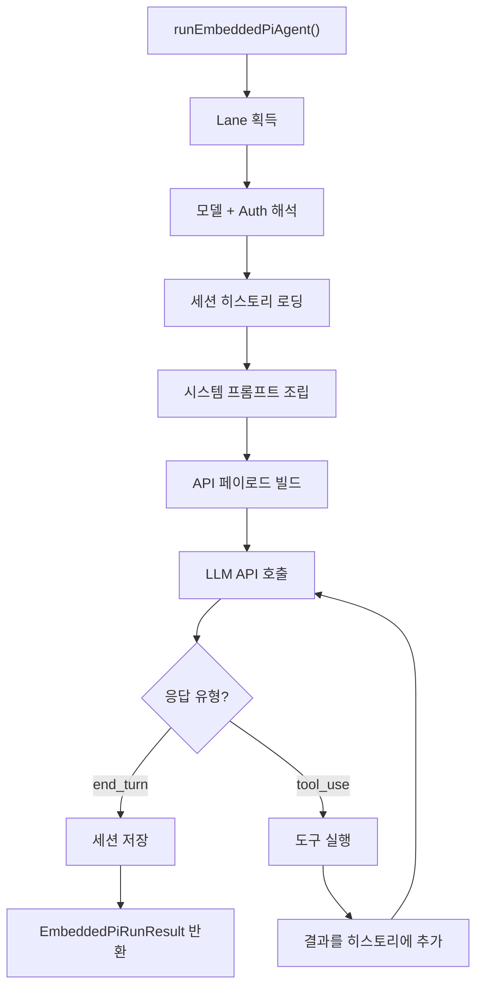

## 개요

에이전트 실행은 **LLM 호출 → 도구 실행 → 재호출**의 반복 루프로 동작한다. LLM이 `end_turn`을 반환할 때까지 이 루프가 계속된다.

**핵심 파일**: `agents/pi-embedded-runner/run.ts`, `agents/pi-embedded-runner/run/attempt.ts`

## 실행 루프 구조



## 단계별 상세

### Lane 획득

세션 Lane을 획득하여 동일 세션의 요청이 직렬로 실행되도록 보장한다:

```
resolveSessionLane(sessionKey) → "session:{key}"
→ Lane에 enqueue
→ 선행 요청 완료 대기
→ Lane 획득 → 실행 시작
```

### LLM API 호출

`runEmbeddedAttempt()` 함수가 단일 API 호출을 수행한다:

```typescript
// 실제 호출 구조 (간소화)
const response = await anthropic.messages.create({
  model: modelId,
  system: systemPrompt,
  messages: conversationHistory,
  tools: toolDefinitions,
  max_tokens: maxTokens,
  stream: true,
});
```

스트리밍 모드로 호출하여, 응답이 생성되는 즉시 클라이언트에 전달한다.

### 응답 처리

LLM 응답의 `stop_reason`에 따라 분기:

| stop_reason | 처리 |
|-------------|------|
| `end_turn` | 최종 응답 → 세션 저장 후 반환 |
| `tool_use` | 도구 실행 → 결과를 히스토리에 추가 → 재호출 |
| `max_tokens` | 토큰 한도 도달 → 응답 반환 |

### 도구 실행

LLM이 `tool_use`를 요청하면:

```
도구 이름 + 파라미터 추출
→ 도구 레지스트리에서 함수 조회
→ 도구 실행 (exec, web_fetch, web_search 등)
→ 실행 결과를 tool_result 메시지로 포맷
→ 히스토리에 추가
→ LLM 재호출
```

도구 실행 중 에러가 발생하면, 에러 메시지를 tool_result로 LLM에 전달하여 에이전트가 에러를 인식하고 대처할 수 있게 한다.

### 과대 도구 결과 처리

`truncateOversizedToolResultsInSession()` 함수가 과대한 도구 결과를 잘라낸다. 도구 결과가 너무 크면 컨텍스트 윈도우를 초과할 수 있기 때문이다.

## 에러 처리와 페일오버

### Auth 프로필 페일오버

```
프로필 A로 API 호출
→ 실패 (rate_limit 또는 auth)
→ 프로필 A를 쿨다운 처리
→ 프로필 B로 재시도
→ 성공 시: 프로필 B 사용 기록
→ 모든 프로필 실패 시: FailoverError
```

### Thinking 레벨 페일오버

일부 모델에서 extended thinking이 지원되지 않으면:

```
thinkLevel="high"로 호출
→ 모델이 thinking 미지원
→ thinkLevel="off"로 다운그레이드 후 재시도
```

### Refusal 스크러빙

Anthropic의 테스트용 거부 토큰이 응답에 포함되면 제거한다. 이전 세션의 오염된 메시지가 새 요청에 영향을 주지 않도록 방지하는 안전장치다.

## 스트리밍

에이전트 실행 중 LLM의 응답이 토큰 단위로 스트리밍된다:

```
LLM 스트림 시작
→ 각 토큰 도착 → ReplyDispatcher에 delta 전달
→ ReplyDispatcher → WebSocket/Slack API로 실시간 전달
→ 스트림 종료 → 최종 응답 확정
```

블록 스트리밍이 활성화되면, 응답을 일정 크기의 블록으로 나누어 전달한다. 이는 Slack의 메시지 업데이트 API 호출을 최소화한다.

## 실행 취소

진행 중인 에이전트 실행을 `chat.abort` RPC로 취소할 수 있다:

```
abort 신호 수신
→ LLM API 호출 취소
→ 진행 중인 도구 실행 취소 (가능한 경우)
→ 부분 응답 전달
→ 세션에 취소 기록
```
