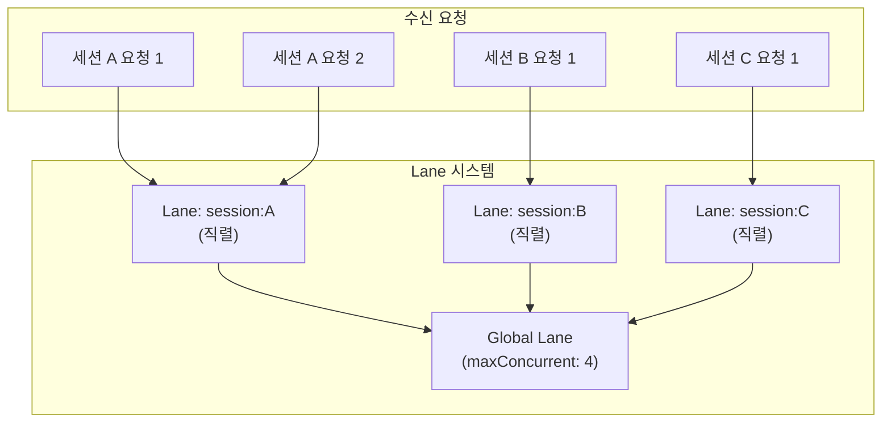

## 개요

Lane 시스템은 에이전트의 동시 실행 수를 제한하여 OOM(Out of Memory)을 방지하면서, 서로 다른 세션의 요청은 병렬로 처리할 수 있게 한다.

**핵심 파일**: `agents/pi-embedded-runner/lanes.ts`

## Lane의 역할



두 가지 수준의 동시성 제어:

### 세션 Lane

같은 세션의 요청은 **직렬로** 실행된다:

```typescript
resolveSessionLane(sessionKey)
// → "session:agent:ceo-advisor:slack:direct:u12345"
```

세션 Lane은 `session:` 접두사 + 세션 키로 구성된다. 같은 세션의 두 번째 요청은 첫 번째 요청이 완료될 때까지 대기한다.

### Global Lane

전체 시스템의 동시 에이전트 실행 수를 제한한다:

```typescript
resolveGlobalLane(lane)
// → CommandLane.Main (기본값)
```

```yaml
agents:
  defaults:
    maxConcurrent: 4    # 최대 4개 에이전트 동시 실행
```

4개를 초과하는 요청은 큐에서 대기한다.

## 동작 예시

t3.medium (4GB RAM) + 8GB swap 환경에서:

```
시점 0s: 세션 A 요청 → Lane 획득 → 실행 시작 (활성: 1/4)
시점 1s: 세션 B 요청 → Lane 획득 → 실행 시작 (활성: 2/4)
시점 2s: 세션 A 요청 2 → 세션 Lane 대기 (A가 실행 중)
시점 3s: 세션 C 요청 → Lane 획득 → 실행 시작 (활성: 3/4)
시점 5s: 세션 A 완료 → 세션 A 요청 2 실행 시작 (활성: 3/4)
시점 6s: 세션 D 요청 → Lane 획득 → 실행 시작 (활성: 4/4)
시점 7s: 세션 E 요청 → Global Lane 대기 (4/4 꽉 참)
시점 8s: 세션 B 완료 → 세션 E 실행 시작 (활성: 4/4)
```

## 메모리 관리

Lane 시스템이 필요한 이유는 메모리 제약 때문이다:

- 각 에이전트 실행은 LLM API 호출, 도구 실행, 세션 히스토리 로딩으로 상당한 메모리를 사용
- pi-agent-core는 Claude Code와 동일한 기반으로, 메모리 릭 가능성이 있음
- t3.medium (4GB)에서 9개 에이전트를 동시 실행하면 OOM 발생 가능
- `maxConcurrent: 4`로 제한하여 안정적 운영

## 설정

```yaml
agents:
  defaults:
    maxConcurrent: 4       # 전체 동시 에이전트 실행 수
```

이 값은 `applyGatewayLaneConcurrency()`(`gateway/server-lanes.ts`)에서 게이트웨이 시작 시 적용된다.

메모리가 충분한 인스턴스(t3.large 이상)에서는 이 값을 늘릴 수 있다.
