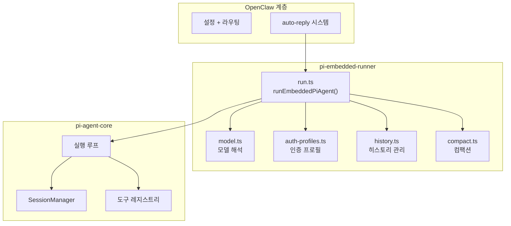

## 개요

OpenClaw의 에이전트 런타임은 **pi-agent-core** 라이브러리를 임베디드 모드로 사용한다. pi-agent-core는 Claude Code와 동일한 기반의 에이전트 실행 엔진으로, LLM 호출, 도구 실행, 세션 관리를 담당한다.

**핵심 파일**: `agents/pi-embedded-runner/run.ts`
**진입 함수**: `runEmbeddedPiAgent()`

## 아키텍처



## 워크스페이스

각 에이전트는 독립적인 워크스페이스 디렉토리를 가진다:

```
agents/{agentId}/workspace/
├── AGENTS.md          # 에이전트 기본 지침
├── SOUL.md            # 성격/페르소나 정의
├── TOOLS.md           # 도구 사용 지침
├── IDENTITY.md        # 아이덴티티 설정
├── BOOT.md            # 부팅 시 실행 지침
├── skills/            # 에이전트별 스킬
│   └── {skill}/
│       └── SKILL.md
└── ...
```

이 파일들은 **부트스트랩 파일**로, 에이전트 실행 시 시스템 프롬프트에 주입된다.

## 모델 해석

`resolveModel()` 함수가 에이전트 설정에서 사용할 모델을 결정한다:

```
에이전트 설정의 model 필드
→ provider/modelId 분리 (예: "anthropic/claude-sonnet-4-5-20250929")
→ 모델 레지스트리에서 모델 정보 조회
→ 컨텍스트 윈도우 정보 확인
→ 컨텍스트 윈도우가 최소 기준 미달 시 → FailoverError
```

### 컨텍스트 윈도우 검증

```typescript
CONTEXT_WINDOW_WARN_BELOW_TOKENS  // 경고 임계값
CONTEXT_WINDOW_HARD_MIN_TOKENS    // 차단 임계값
```

모델의 컨텍스트 윈도우가 `HARD_MIN_TOKENS` 미만이면 에이전트 실행이 차단된다.

## 인증 프로필

에이전트가 LLM API를 호출할 때 사용하는 인증 정보:

```
resolveAuthProfileOrder()
→ 설정에서 프로필 순서 결정
→ 쿨다운 중인 프로필 건너뛰기
→ 사용 가능한 첫 번째 프로필로 API 호출
→ 실패 시 다음 프로필로 페일오버
```

페일오버 사유 분류:
- `rate_limit` — API 속도 제한
- `auth` — 인증 실패
- `context_overflow` — 컨텍스트 윈도우 초과
- `billing` — 결제 문제
- `timeout` — 요청 타임아웃

## 실행 결과

`EmbeddedPiRunResult` 타입으로 반환된다:

```typescript
type EmbeddedPiRunResult = {
  role: string;              // "assistant"
  content: string;           // 응답 텍스트
  usage: UsageAccumulator;   // 토큰 사용량
  model: string;             // 사용된 모델
  warnings: string[];        // 경고 목록
  // ...
}
```

### 사용량 추적

`UsageAccumulator`는 다중 도구 호출 턴에 걸친 총 사용량을 추적한다:

```typescript
type UsageAccumulator = {
  input: number;             // 총 입력 토큰
  output: number;            // 총 출력 토큰
  cacheRead: number;         // 캐시 읽기 토큰
  cacheWrite: number;        // 캐시 쓰기 토큰
  total: number;             // 총 토큰
  lastInput: number;         // 마지막 API 호출의 입력 토큰
  lastCacheRead: number;     // 마지막 API 호출의 캐시 읽기
  lastCacheWrite: number;    // 마지막 API 호출의 캐시 쓰기
}
```

`last*` 필드를 별도로 추적하는 이유: 누적된 캐시 필드는 컨텍스트 크기를 과대 추정하기 때문이다. 각 도구 호출 턴마다 전체 컨텍스트를 보고하므로, 마지막 API 호출의 값만 사용해야 정확하다.
