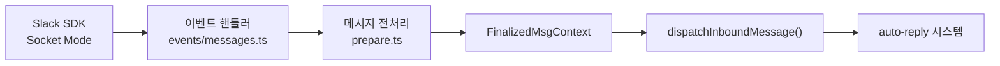

## 개요

OpenClaw은 Slack, Discord, Telegram 등 다양한 메시징 플랫폼을 **채널**이라는 추상화 계층을 통해 통합한다. 각 플랫폼은 `ChannelDock` 인터페이스를 구현하여 플랫폼별 차이를 숨긴다.

**핵심 파일**: `channels/dock.ts`, `channels/plugins/index.ts`

## ChannelDock 인터페이스

`ChannelDock`은 채널의 메타데이터와 능력(capabilities)을 선언하는 인터페이스다:

```typescript
type ChannelDock = {
  id: string;                    // 채널 식별자 ("slack", "discord" 등)
  label: string;                 // 표시 이름

  capabilities: {
    chatTypes: ChatType[];       // 지원하는 대화 유형
    nativeCommands?: boolean;    // 슬래시 커맨드 네이티브 지원
    blockStreaming?: boolean;    // 블록 스트리밍 지원
    reactions?: boolean;         // 리액션 지원
    threads?: boolean;           // 스레딩 지원
    media?: MediaCapabilities;   // 미디어 유형 지원
  };

  groups?: {
    mentionPattern?: RegExp;     // 그룹 멘션 패턴
  };

  threading?: {
    mode?: "native" | "simulated";
    replyToMode?: "off" | "first" | "all";
  };
}
```

### ChatType

대화 유형을 나타내는 유니온 타입:

```typescript
type ChatType = "direct" | "group" | "channel";
```

| 유형 | 설명 | 예시 |
|------|------|------|
| `direct` | 1:1 DM | Slack DM |
| `group` | 그룹 대화 | Slack MPIM |
| `channel` | 공개/비공개 채널 | Slack #general |

스레드는 별도 ChatType이 아니라 `ChannelCapabilities.chatTypes`에서 `ChatType | "thread"` 유니온으로 처리된다.

## 채널 플러그인 레지스트리

`channels/plugins/index.ts`에서 모든 채널 플러그인이 등록된다. `listChannelPlugins()` 함수로 등록된 플러그인 목록을 조회할 수 있다.

지원 채널:
- Slack, Discord, Telegram, WhatsApp
- Signal, iMessage, Google Chat, Mattermost
- MS Teams, Matrix, Line, IRC, Twitch 등

각 채널 플러그인은 `gatewayMethods` 배열을 통해 채널 고유의 RPC 메서드를 게이트웨이에 등록할 수 있다.

## 채널 매니저

`createChannelManager()`(`gateway/server-channels.ts`)가 모든 채널 플러그인의 모니터를 관리한다:

```
설정에서 활성 채널 목록 추출
→ 각 채널 플러그인의 모니터 생성
→ 모니터 시작 (예: Slack Socket Mode 연결)
→ 메시지 수신 시 auto-reply 시스템으로 전달
```

채널 매니저는 핫 리로드를 지원한다. 설정 변경 시 해당 채널의 모니터만 재시작한다.

## 메시지 흐름

채널에서 수신한 메시지가 내부 시스템으로 전달되는 과정:



각 채널 플러그인은 플랫폼 SDK에서 메시지를 수신하고, 채널 독립적인 `FinalizedMsgContext` 형태로 변환하여 auto-reply 시스템에 전달한다. 이 추상화 덕분에 auto-reply 이후의 로직은 어떤 채널에서 온 메시지인지 신경 쓰지 않아도 된다.

## 응답 전달

에이전트의 응답도 채널 추상화를 통해 전달된다:

```
에이전트 응답 → ReplyDispatcher → 채널별 전달 로직 → 플랫폼 API
```

`ReplyDispatcher`는 채널별로 구현되며, Slack의 경우 스레딩, 리액션, 타이핑 표시 등 플랫폼 고유 UX를 처리한다.
