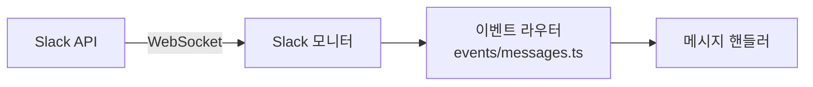

## 개요

Slack은 OpenClaw에서 가장 풍부하게 구현된 채널이다. 120개 이상의 소스 파일로 구성되며, Socket Mode 또는 HTTP Events API를 통해 이벤트를 수신한다.

**핵심 디렉토리**: `slack/monitor/`

## 연결 모드

### Socket Mode (기본)

- `appToken` (xapp-..., `connections:write` 스코프) + `botToken` (xoxb-...) 필요
- 서버가 WebSocket 연결을 개시 — 퍼블릭 웹훅 URL 불필요
- 보안과 단순성 면에서 권장

### HTTP Events API 모드

- `botToken` + `signingSecret`으로 요청 검증
- Slack 앱 설정에서 웹훅 URL 구성 필요
- 멀티 계정 시 계정별 고유 `webhookPath` 설정으로 등록 충돌 방지

```yaml
channels:
  slack:
    mode: "http"          # "socket" (기본) 또는 "http"
    signingSecret: "..."  # HTTP 모드 시 필수
    webhookPath: "/slack/events"  # 기본값
```

## DM 정책

| 정책 | 동작 |
|------|------|
| `pairing` (기본) | 미인식 발신자에게 페어링 코드 요구. `openclaw pairing approve slack <code>` |
| `allowlist` | 지정 사용자만 허용 (`allowFrom`) |
| `open` | `allowFrom`에 `"*"` 포함 시 모든 발신자 허용 |
| `disabled` | DM 완전 차단 |

관련 플래그: `dm.enabled` (기본 true), `dm.groupEnabled` (그룹 DM 기본 false)

## 스트리밍

| 설정 | 효과 |
|------|------|
| `off` | 라이브 프리뷰 비활성 |
| `partial` (기본) | 프리뷰를 최신 출력으로 교체 |
| `block` | 청크 업데이트 추가 |
| `progress` | 생성 중 상태 표시 후 최종 텍스트 전송 |

`nativeStreaming: true` (기본)는 Slack 네이티브 API(`chat.startStream/appendStream/stopStream`) 사용. `assistant:write` 스코프와 스레드 필요.

## 멀티 계정 (Named Accounts)

Named 계정은 설정을 전략적으로 상속한다:
- `channels.slack.allowFrom` → 모든 계정에 적용 (오버라이드 가능)
- `channels.slack.accounts.default.allowFrom` → 기본 계정에만 적용
- Named 계정은 기본 계정의 설정을 상속하지 **않음**

## 네이티브 슬래시 커맨드

Slack 슬래시 커맨드 URL을 웹훅 경로와 동일하게 설정하면 OpenClaw이 처리한다.

## 토큰 모델

- Bot 토큰이 쓰기에 우선 사용
- User 토큰(`xoxp-...`)은 기본 읽기 전용 (`userTokenReadOnly: true`)
- 설정 값이 환경변수보다 우선
- 환경변수 폴백(`SLACK_BOT_TOKEN`, `SLACK_APP_TOKEN`)은 기본 계정에만 적용
- `chat:write.customize` 스코프로 커스텀 사용자명/아이콘 가능

## 설정 예시

```yaml
channels:
  slack:
    enabled: true
    mode: "socket"
    appToken: "xapp-..."
    botToken: "xoxb-..."
    dmPolicy: "pairing"
    groupPolicy: "allowlist"
    channels:
      C12345:
        requireMention: true
    ackReaction: "eyes"
    streaming: "partial"
    nativeStreaming: true
    textChunkLimit: 4000
```

---

## 내부 구현 상세

### 연결 구조



각 Slack App(에이전트별 1개)이 독립적인 WebSocket 연결을 유지한다. 하나의 App Token을 여러 프로세스에서 사용하면 이벤트가 라운드 로빈으로 분배되어 메시지 유실이 발생할 수 있다.

## 이벤트 처리

### 이벤트 등록

`registerSlackMessageEvents()` 함수가 두 가지 이벤트를 등록한다:

| 이벤트 | 설명 | 처리 |
|--------|------|------|
| `message` | 일반 메시지 (채널, DM, 그룹) | 필터링 후 핸들러 전달 |
| `app_mention` | `@봇이름` 멘션 | `wasMentioned: true` 설정 |

### 메시지 서브타입 처리

`message` 이벤트의 서브타입에 따라 다르게 처리된다:

| 서브타입 | 처리 |
|---------|------|
| (없음) | 정상 메시지 처리 |
| `file_share` | 파일 첨부 메시지 처리 |
| `bot_message` | `allowBots` 설정에 따라 처리 또는 무시 |
| `message_changed` | 메시지 편집 시스템 이벤트 |
| `message_deleted` | 메시지 삭제 시스템 이벤트 |
| `thread_broadcast` | 스레드 브로드캐스트 이벤트 |
| 기타 | 무시 |

### 디바운싱

사용자가 빠르게 여러 메시지를 연속 전송하면 디바운서가 이를 하나로 합친다:

```
메시지 A (0ms) → 디바운서 enqueue
메시지 B (500ms) → 디바운서 enqueue
메시지 C (800ms) → 디바운서 enqueue
→ 타이머 만료 → A+B+C 텍스트 결합 → 한 번에 처리
```

합쳐진 메시지의 모든 ID를 `MessageSids` 배열에 보존하여 추적 가능하다.

### 중복 방지

`markMessageSeen()` 함수로 이미 처리한 메시지를 추적한다. 동일한 `(channel, ts)` 조합의 메시지가 다시 도착하면 무시한다.

## 메시지 전처리

`prepareSlackMessage()` 함수가 원시 Slack 이벤트를 시스템 내부 표현으로 변환한다. 주요 단계:

### 채널 정보 해석
- 채널 타입 결정: im (DM), mpim (그룹 DM), channel, group
- 채널 이름 조회

### 멘션 감지
- `<@botUserId>` 패턴 감지 (명시적 멘션)
- 스레드 내 봇 답글 감지 (암묵적 멘션)
- 커스텀 멘션 패턴 (설정 가능)

### 미디어 처리
- Slack 파일 다운로드 (이미지, 문서)
- 파일 크기 제한 검사
- 스레드 시작 메시지의 미디어 폴백

### Ack 리액션
설정에 따라 메시지에 이모지 리액션을 추가하여 "처리 시작" 알림:

```yaml
# defaults.yml
channels:
  slack:
    ackReaction: "eyes"          # 이모지 shortcode (문자열)
```

`ackReaction`은 문자열 shortcode다. 응답 완료 후 자동으로 제거된다.

## 응답 전달

`dispatchPreparedSlackMessage()` 함수가 에이전트 응답을 Slack에 전달한다:

### 스레딩

`replyToMode` 설정에 따라 응답 위치가 결정된다:

| 모드 | 동작 |
|------|------|
| `off` | 스레딩 없이 채널에 직접 응답 |
| `first` | 첫 응답만 스레드, 이후 채널에 |
| `all` | 모든 응답을 스레드에 |

### 타이핑 표시

에이전트가 응답을 생성하는 동안 Slack에 "입력 중..." 표시:

```
메시지 수신 → 타이핑 시작
→ 에이전트 실행 (수 초 ~ 수 분)
→ 응답 전송 → 타이핑 해제
```

### Ack 리액션 정리

응답이 완료되면 처리 시작 시 추가했던 ack 리액션을 제거한다.
