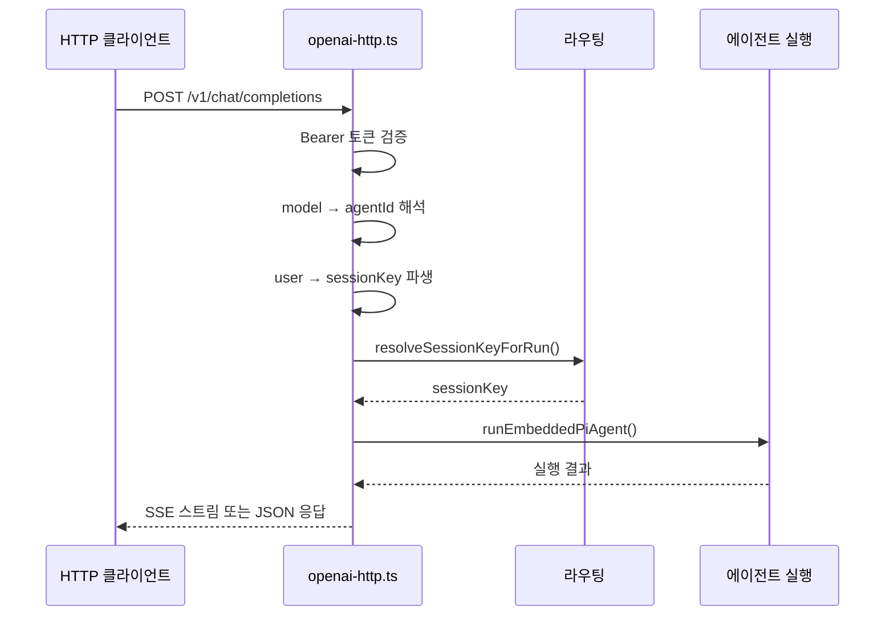

## 개요

게이트웨이는 OpenAI 호환 HTTP API를 제공하여, 표준 OpenAI 클라이언트 라이브러리로 OpenClaw 에이전트를 호출할 수 있다.

**핵심 파일**: `gateway/openai-http.ts`, `gateway/http-utils.ts`

## 엔드포인트

### POST /v1/chat/completions

OpenAI Chat Completions API와 호환되는 엔드포인트. `gateway.http.endpoints.chatCompletions.enabled` 설정으로 활성화한다.

**요청**:
```bash
curl -X POST http://localhost:18789/v1/chat/completions \
  -H "Authorization: Bearer <gateway-token>" \
  -H "Content-Type: application/json" \
  -d '{
    "model": "ceo-advisor",
    "messages": [{"role": "user", "content": "분기 실적 분석해줘"}],
    "stream": true
  }'
```

**에이전트 선택**: `model` 필드에 에이전트 ID를 지정하거나, `X-OpenClaw-Agent` 헤더를 사용한다.

**세션 동작**:
- `user` 필드 생략: stateless (매 요청 새 세션)
- `user` 필드 제공: 해당 사용자의 안정적 세션 유지

**스트리밍**: `stream: true`로 SSE(Server-Sent Events) 스트리밍 응답을 받는다.

### GET /v1/models

사용 가능한 모델(에이전트) 목록을 반환한다.

```bash
curl http://localhost:18789/v1/models \
  -H "Authorization: Bearer <gateway-token>"
```

### POST /v1/responses

OpenResponses API 엔드포인트. `gateway.http.endpoints.responses.enabled` 설정으로 활성화한다.

## 인증

HTTP API 요청에는 Bearer 토큰이 필요하다:

```
Authorization: Bearer <OPENCLAW_GATEWAY_TOKEN>
```

게이트웨이 토큰은 `gateway.auth.token` 설정 또는 `OPENCLAW_GATEWAY_TOKEN` 환경변수로 지정한다.

## 내부 흐름

HTTP 요청이 에이전트 실행으로 변환되는 과정:



### 세션 키 파생

HTTP 요청에서 세션 키가 생성되는 방식:

| user 필드 | 세션 키 |
|-----------|--------|
| 없음 | 임시 세션 (stateless) |
| `"user-123"` | `agent:{agentId}:http:direct:user-123` |
| `"session:custom-key"` | `agent:{agentId}:custom-key` (직접 지정) |

## Control UI

`/control-ui` 경로에서 웹 기반 대시보드를 제공한다. `gateway.controlUi.enabled` 설정으로 활성화/비활성화한다.

Control UI는 WebSocket을 통해 게이트웨이와 통신하며, 에이전트 상태 모니터링, 세션 관리, 실시간 채팅 등의 기능을 제공한다.
