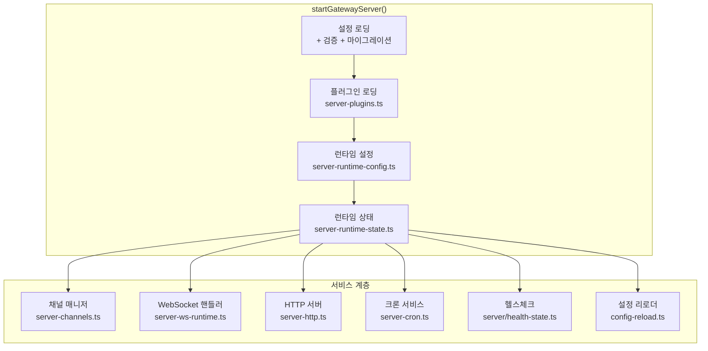

## 개요

게이트웨이는 OpenClaw의 **컨트롤 플레인**이다. 모든 채널 연결, 에이전트 라우팅, HTTP API, WebSocket 통신을 단일 프로세스에서 관리한다.

**핵심 파일**: `gateway/server.impl.ts`
**진입 함수**: `startGatewayServer(port = 18789, opts)`

## 서비스 구조

게이트웨이는 여러 독립적인 서비스를 초기화하고 관리한다:



## 시작 시퀀스

`startGatewayServer()` 함수의 실행 순서:

### 설정 단계

```
OPENCLAW_GATEWAY_PORT 환경변수 설정
→ readConfigFileSnapshot(): 설정 파일 읽기
→ 레거시 항목 감지 시: migrateLegacyConfig() 자동 마이그레이션
→ 재읽기 + 유효성 검증 (실패 시 종료)
→ applyPluginAutoEnable(): 환경변수 기반 플러그인 자동 활성화
→ loadConfig(): 최종 OpenClawConfig 생성
```

### 서비스 초기화 단계

```
진단 하트비트 시작 (diagnostics 설정 시)
→ SIGUSR1 재시작 정책 설정
→ 서브에이전트 레지스트리 초기화
→ 기본 에이전트 ID + 워크스페이스 해석
→ 플러그인 로딩: loadGatewayPlugins()
→ 채널별 로거 생성
→ 게이트웨이 메서드 목록 구성 (기본 + 채널 + 플러그인)
→ 런타임 설정 해석: resolveGatewayRuntimeConfig()
→ TLS 설정: loadGatewayTlsRuntime()
```

### 네트워크 단계

```
HTTP/WS 서버 바인딩
→ WebSocket 핸들러 등록: attachGatewayWsHandlers()
→ 채널 매니저 생성: createChannelManager()
→ 크론 서비스 생성: buildGatewayCronService()
→ 헬스체크 스냅샷 초기화
→ 디스커버리 시작: startGatewayDiscovery()
→ 사이드카 시작: startGatewaySidecars()
→ 설정 리로더 시작: startGatewayConfigReloader()
→ 업데이트 체크 스케줄링
```

## GatewayServerOptions

```typescript
type GatewayServerOptions = {
  bind?: "loopback" | "lan" | "tailnet" | "auto";
  host?: string;                    // bind 오버라이드
  controlUiEnabled?: boolean;       // Control UI 제공 여부
  openAiChatCompletionsEnabled?: boolean;  // /v1/chat/completions
  openResponsesEnabled?: boolean;          // /v1/responses
  auth?: GatewayAuthConfig;
  tailscale?: GatewayTailscaleConfig;
}
```

### Bind 모드

| 모드 | 주소 | 용도 |
|------|------|------|
| `loopback` | `127.0.0.1` | 로컬 전용 (기본) |
| `lan` | `0.0.0.0` | LAN 접근 허용 |
| `tailnet` | Tailscale IPv4 | Tailscale 네트워크만 |
| `auto` | loopback 우선, LAN 폴백 | 자동 결정 |

## 런타임 상태

`createGatewayRuntimeState()` 함수가 게이트웨이의 런타임 상태를 관리한다:

- 동시 에이전트 실행 추적
- 세션 캐시
- 헬스 스냅샷
- 연결된 노드 목록

## 종료 처리

`createGatewayCloseHandler()`가 정리 작업을 수행한다:

```
채널 모니터 중지
→ 크론 서비스 중지
→ WebSocket 연결 종료
→ HTTP 서버 종료
→ 플러그인 정리
→ 진단 하트비트 중지
```

`close()` 함수에 `reason`과 `restartExpectedMs`를 전달하여 클라이언트에 재시작 예상 시간을 알릴 수 있다.
