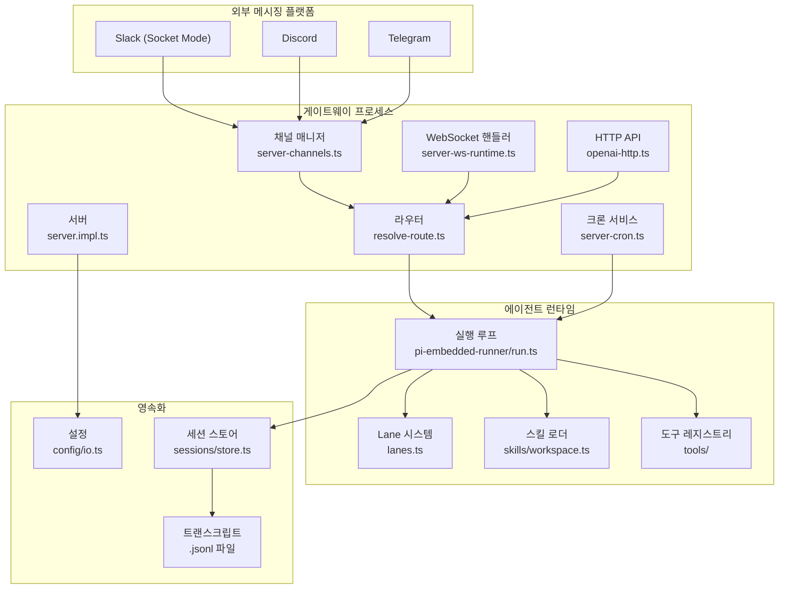
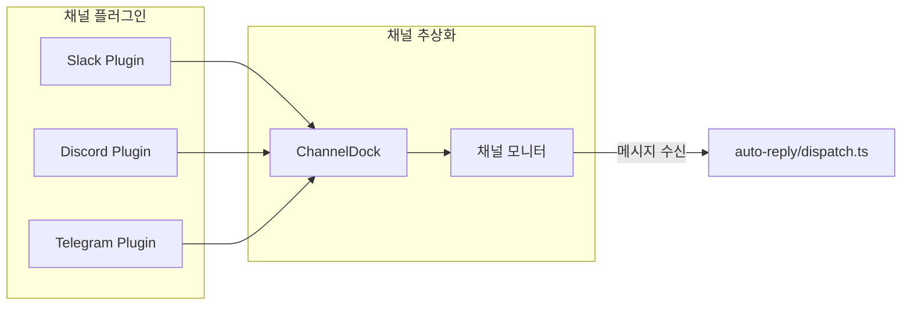
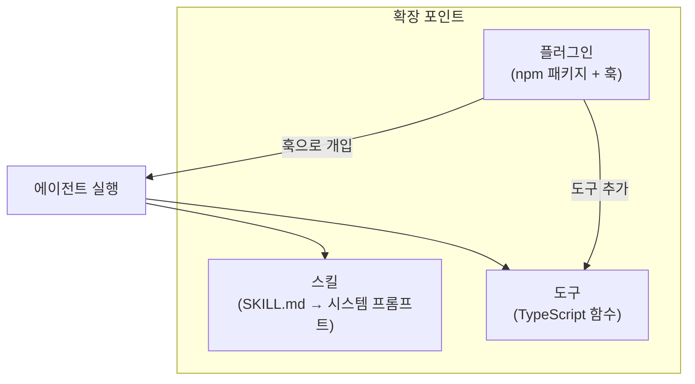

## 전체 구조

OpenClaw은 **게이트웨이 중심 아키텍처**를 채택한다. 단일 게이트웨이 프로세스가 모든 채널 연결, 에이전트 라우팅, 세션 관리를 담당한다.



## 핵심 컴포넌트

### 게이트웨이 (컨트롤 플레인)

게이트웨이는 `startGatewayServer()` 함수(`gateway/server.impl.ts`)로 시작된다. 기본 포트는 `18789`이며, 다음 서비스를 초기화한다:

| 서비스 | 파일 | 역할 |
|--------|------|------|
| HTTP 서버 | `gateway/server-http.ts` | OpenAI 호환 `/v1/chat/completions` 엔드포인트 |
| WebSocket | `gateway/server-ws-runtime.ts` | 클라이언트(Control UI, 노드)와 실시간 통신 |
| 채널 매니저 | `gateway/server-channels.ts` | Slack, Discord 등 채널 모니터 관리 |
| 크론 서비스 | `gateway/server-cron.ts` | 스케줄 기반 에이전트 실행 |
| 플러그인 로더 | `gateway/server-plugins.ts` | 플러그인 디스커버리 및 훅 등록 |
| 설정 리로더 | `gateway/config-reload.ts` | 설정 파일 변경 감지 + 핫 리로드 |

서버 시작 시퀀스 (`startGatewayServer`):

```
설정 로딩 → 레거시 마이그레이션 → 유효성 검증
→ 플러그인 자동 활성화 → 플러그인 로딩
→ 런타임 설정 해석 → TLS 설정
→ 채널 매니저 생성 → 크론 서비스 생성
→ WebSocket/HTTP 핸들러 등록
→ 디스커버리 시작 → 헬스체크 시작
```

### 채널 시스템

채널은 외부 메시징 플랫폼과의 연결을 추상화한다. 각 채널은 **ChannelDock** 인터페이스(`channels/dock.ts`)를 구현하여 플랫폼별 차이를 숨긴다.



Slack의 경우, Socket Mode를 통해 WebSocket으로 이벤트를 수신한다. 메시지 이벤트가 도착하면:

- `slack/monitor/events/messages.ts` — 이벤트 등록 및 필터링
- `slack/monitor/message-handler/prepare.ts` — 메시지 전처리 (스레드, 사용자 정보 추출)
- `slack/monitor/message-handler/dispatch.ts` — auto-reply 시스템으로 전달

### 라우팅

라우팅은 "이 메시지를 어떤 에이전트가 처리할 것인가"를 결정한다. `resolveAgentRoute()` 함수(`routing/resolve-route.ts`)가 핵심이다.

바인딩 매칭 우선순위:

```
peer (특정 사용자/채널) → parent peer (스레드 부모) → guild → team → account → channel → default
```

매칭 결과로 `ResolvedAgentRoute`가 생성되며, 여기에 **세션 키**가 포함된다. 세션 키는 에이전트, 채널, 대화 상대를 식별하는 복합 키다:

```
agent:{agentId}:{channel}:direct:{peerId}
agent:{agentId}:{channel}:group:{groupId}
agent:{agentId}:{channel}:group:{groupId}:thread:{threadId}
```

### 에이전트 런타임

에이전트는 `runEmbeddedPiAgent()` 함수(`agents/pi-embedded-runner/run.ts`)로 실행된다. pi-agent-core 라이브러리를 임베디드 모드로 사용하며, 다음 루프를 실행한다:

```
모델 + 인증 프로필 해석
→ 세션 히스토리 로딩
→ 스킬 로딩 + 시스템 프롬프트 조립
→ 도구 레지스트리 구성
→ Lane 획득 (동시성 제어)
→ LLM 호출 루프: {
    프롬프트 전송 → 응답 수신
    → 도구 호출이면: 도구 실행 → 결과를 히스토리에 추가 → 재호출
    → 종료면: 응답 반환
  }
→ 세션 저장 + 사용량 기록
```

**Lane 시스템**(`lanes.ts`)은 동시 에이전트 실행 수를 제한한다. 기본 `maxConcurrent: 4`로, OOM을 방지하면서 여러 에이전트가 동시에 작업할 수 있게 한다.

### 세션 관리

세션은 두 가지 계층으로 관리된다:

- **sessions.json** — 세션 메타데이터 (세션 키, 최종 업데이트 시각, 모델 설정)
- **{sessionId}.jsonl** — 트랜스크립트 (실제 메시지 히스토리, JSONL 형식)

세션 키는 에이전트 + 채널 + 대화 상대의 조합이며, `dmScope` 설정에 따라 세분화 수준이 달라진다:

| dmScope | 세션 키 패턴 |
|---------|-------------|
| `main` | `agent:{id}:main` (모든 DM이 하나의 세션) |
| `per-peer` | `agent:{id}:direct:{peerId}` |
| `per-channel-peer` | `agent:{id}:{channel}:direct:{peerId}` |
| `per-account-channel-peer` | `agent:{id}:{account}:{channel}:direct:{peerId}` |

## 설정 시스템

모든 동작은 `OpenClawConfig` 타입의 설정 객체에 의해 결정된다. 설정은 YAML/JSON5 파일에서 로딩되며, Zod 스키마로 검증된다.

```
YAML 파일 → JSON5 파싱 → 환경변수 치환 (${VAR})
→ include 처리 → 경로 정규화 → 오버라이드 적용
→ Zod 검증 → OpenClawConfig 객체
```

핫 리로드를 지원하여, 설정 파일을 변경하면 게이트웨이 재시작 없이 적용된다.

## 확장 포인트

OpenClaw은 세 가지 확장 메커니즘을 제공한다:

- **스킬**: `SKILL.md` 마크다운 파일로 정의. 시스템 프롬프트에 주입되어 에이전트의 능력을 확장
- **도구**: TypeScript 함수로 정의. 에이전트가 실행 중에 호출할 수 있는 외부 기능
- **플러그인**: npm 패키지로 배포. 게이트웨이 라이프사이클 훅, HTTP 라우트, 도구를 추가


