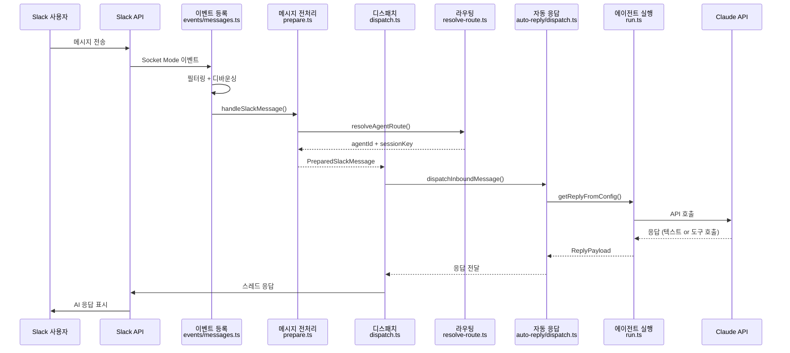

이 문서는 Slack 메시지 하나가 도착해서 AI 응답이 전달되기까지의 **전체 흐름**을 코드 레벨에서 추적한다. 각 단계에서 어떤 파일의 어떤 함수가 호출되는지를 따라간다.

## 전체 흐름



## 단계별 상세

### 이벤트 수신

**파일**: `slack/monitor/events/messages.ts`
**함수**: `registerSlackMessageEvents()`

Slack Socket Mode 연결을 통해 두 가지 이벤트를 수신한다:

- **`message`** — 일반 Slack 메시지 (채널, DM, 그룹)
- **`app_mention`** — `@봇이름` 멘션 이벤트

이벤트가 도착하면 다음을 검사한다:

```
이벤트 수신
→ 자기 자신의 메시지인가? → 무시
→ 허용된 채널인가? → 아니면 무시
→ 이미 처리한 메시지인가? (markMessageSeen) → 무시
→ message_changed/deleted? → 시스템 이벤트로 처리
→ 통과 → 디바운서에 enqueue
```

**디바운싱**: 사용자가 빠르게 여러 메시지를 보내면 하나로 합쳐서 처리한다. 디바운서가 짧은 시간 내의 메시지를 모아서 텍스트를 결합하고, 마지막 메시지의 옵션으로 한 번에 전달한다.

### 메시지 전처리

**파일**: `slack/monitor/message-handler/prepare.ts`
**함수**: `prepareSlackMessage()`

이 단계에서 원시 Slack 이벤트가 시스템 내부 표현(`PreparedSlackMessage`)으로 변환된다. 여러 필터링 게이트를 통과해야 하며, 하나라도 실패하면 `null`을 반환하여 메시지를 드랍한다.

**필터링 게이트 순서**:

| 게이트 | 검사 내용 |
|--------|----------|
| 봇 메시지 필터 | `allowBots=true`가 아니면 봇의 메시지 무시 |
| 채널 허용목록 | `groupPolicy` 설정에 따른 채널 접근 제어 |
| DM 정책 | DM 허용 여부 (open/pairing/disabled) |
| 사용자 인가 | 채널별 사용자 허용목록 |
| 멘션 게이트 | `requireMention` 채널에서 멘션 없으면 무시 |

**라우팅 호출**: 필터를 통과하면 `resolveAgentRoute()`를 호출하여 어떤 에이전트가 이 메시지를 처리할지 결정한다.

**컨텍스트 조립**: 최종적으로 `FinalizedMsgContext` 객체를 생성한다. 이 객체에는 채널 정보, 발신자, 스레드 정보, 미디어 첨부파일, 세션 키 등 이후 처리에 필요한 모든 데이터가 포함된다.

### 라우팅

**파일**: `routing/resolve-route.ts`
**함수**: `resolveAgentRoute()`

메시지를 적절한 에이전트로 라우팅한다. 바인딩 목록에서 가장 구체적인 매칭을 찾는 알고리즘이다.

**매칭 우선순위** (위에서 아래로, 먼저 매칭되면 사용):

```
peer (특정 사용자/채널 ID)
  ↓ 매칭 실패
parent peer (스레드 부모 채널의 바인딩 상속)
  ↓ 매칭 실패
guild (Discord 서버 등)
  ↓ 매칭 실패
team (Slack 워크스페이스)
  ↓ 매칭 실패
account (특정 Slack 계정, 와일드카드 제외)
  ↓ 매칭 실패
channel (와일드카드 계정 매칭)
  ↓ 매칭 실패
default (기본 에이전트)
```

매칭이 결정되면 `ResolvedAgentRoute`를 반환한다:

```typescript
{
  agentId: "ceo-advisor",           // 처리할 에이전트
  channel: "slack",                 // 채널 유형
  accountId: "ceo",                 // Slack 계정
  sessionKey: "agent:ceo-advisor:slack:direct:U12345",  // 세션 키
  mainSessionKey: "agent:ceo-advisor:main",             // 메인 세션 키
  matchedBy: "binding.account"      // 매칭 방법 (디버깅용)
}
```

### 디스패치

**파일**: `slack/monitor/message-handler/dispatch.ts`
**함수**: `dispatchPreparedSlackMessage()`

전처리된 메시지를 auto-reply 시스템에 전달하기 전에 Slack 고유의 UX 요소를 설정한다:

- **타이핑 표시**: 적절한 스레드에서 "입력 중..." 상태를 시작
- **Ack 리액션**: 설정에 따라 메시지에 이모지 반응 추가 (처리 시작 알림)
- **스레딩 설정**: `replyToMode` 설정에 따라 응답 위치 결정 (스레드/루트)
- **ReplyDispatcher 생성**: 응답 전달, 타이핑 해제, 에러 처리를 관리하는 객체

그 후 `dispatchInboundMessage()`를 호출하여 핵심 로직에 진입한다.

### 자동 응답

**파일**: `auto-reply/reply/dispatch-from-config.ts`
**함수**: `dispatchReplyFromConfig()`

채널에 독립적인 핵심 응답 로직이다. 이 단계에서 실제 AI 에이전트가 실행된다.

```
중복 메시지 검사 → 중복이면 스킵
→ 오디오 컨텍스트 감지 (TTS 관련)
→ 세션 TTS 설정 조회
→ getReplyFromConfig() 호출 (에이전트 실행)
→ 응답을 routeReply()로 채널에 전달
→ 진단 로그 기록
```

`getReplyFromConfig()` 함수(`auto-reply/reply.ts`)가 실제 에이전트 실행을 트리거한다. 이 함수 내부에서:

- 슬래시 커맨드 감지 및 처리 (예: `/compact`, `/reset`)
- 일반 메시지인 경우 `runEmbeddedPiAgent()` 호출

### 에이전트 실행

**파일**: `agents/pi-embedded-runner/run.ts`
**함수**: `runEmbeddedPiAgent()`

이것이 AI 에이전트의 핵심 실행 루프다. 상세 내용은 [에이전트 런타임](/agents/runtime/) 문서에서 다룬다.

핵심 흐름:

```
Lane 획득 (동시성 제어)
→ 모델 + 인증 프로필 해석
→ 컨텍스트 윈도우 검증
→ 세션 히스토리 로딩
→ 시스템 프롬프트 조립 (스킬, 메모리, 도구 포함)
→ LLM API 호출 루프:
    프롬프트 전송 → 응답 수신
    → tool_use → 도구 실행 → 결과를 히스토리에 추가 → 재호출
    → end_turn → 최종 응답 반환
→ 세션 저장 + 사용량 기록
→ EmbeddedPiRunResult 반환
```

### 응답 전달

에이전트 실행이 완료되면, 응답이 역방향으로 전달된다:

```
EmbeddedPiRunResult
→ dispatchReplyFromConfig() → ReplyPayload 생성
→ routeReply() → 채널별 전달
→ ReplyDispatcher → Slack API 호출
→ 스레드에 응답 메시지 게시
→ Ack 리액션 제거 (설정 시)
→ 타이핑 표시 해제
→ 보류 히스토리 클리어
```

## 주요 데이터 타입

이 흐름에서 핵심적인 타입들:

| 타입 | 파일 | 역할 |
|------|------|------|
| `SlackMessageEvent` | Slack SDK | 원시 Slack 이벤트 |
| `PreparedSlackMessage` | `prepare.ts` | 전처리된 메시지 + 라우팅 결과 |
| `FinalizedMsgContext` | `auto-reply/templating.ts` | 채널 독립 메시지 컨텍스트 |
| `ResolvedAgentRoute` | `resolve-route.ts` | 라우팅 결과 (agentId + sessionKey) |
| `ReplyDispatcher` | `reply-dispatcher.ts` | 응답 전달 추상화 |
| `EmbeddedPiRunResult` | `run.ts` | 에이전트 실행 결과 |
| `ReplyPayload` | `auto-reply/types.ts` | 채널로 전달할 최종 응답 |

## 에러 처리

각 단계에서 에러 처리 전략이 다르다:

| 단계 | 에러 처리 |
|------|----------|
| 이벤트 수신 | try-catch → `danger()` 로깅, 다음 이벤트 계속 처리 |
| 전처리 | `null` 반환으로 메시지 드랍 (정상 경로) |
| 라우팅 | 매칭 실패 시 기본 에이전트로 폴백 |
| 자동 응답 | 중복 메시지 스킵, fast abort 감지 |
| 에이전트 실행 | Auth 프로필 페일오버, 모델 페일오버, 컨텍스트 오버플로우 처리 |
| 응답 전달 | 타이핑 해제 실패 등은 로깅만, 메인 흐름 블록 안 함 |
