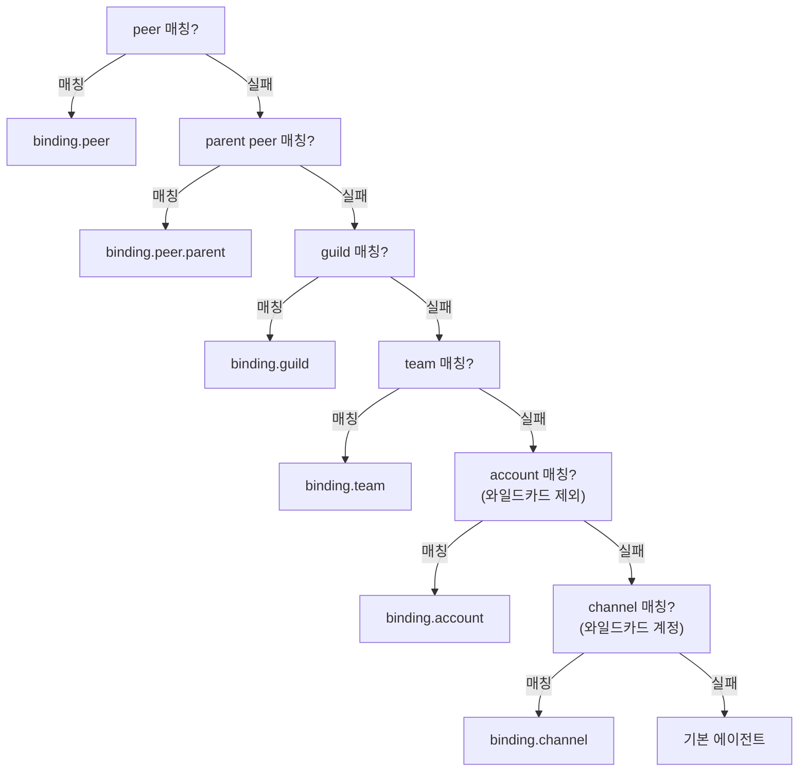

## 개요

바인딩(Binding)은 "이 메시지를 어떤 에이전트가 처리할 것인가"를 결정하는 규칙이다. `resolveAgentRoute()` 함수(`routing/resolve-route.ts`)가 바인딩 목록에서 가장 구체적인 매칭을 찾아 에이전트를 결정한다.

## 바인딩 구조

```typescript
type AgentRouteBinding = {
  type?: string;          // 바인딩 유형 (예: "acp")
  comment?: string;       // 설명용 주석
  agentId: string;        // 대상 에이전트
  match: {
    channel: string;      // 필수: 채널 유형 ("slack", "discord" 등)
    accountId?: string;   // 선택: 채널 계정 ("*"로 와일드카드)
    peer?: {
      kind: ChatType;     // "direct" | "group" | "channel"
      id: string;         // 대화 상대 ID
    };
    guildId?: string;     // Discord 서버 ID
    teamId?: string;      // Slack 워크스페이스 ID
    roles?: string[];     // Discord 역할 기반 라우팅
  };
}
```

## 매칭 알고리즘

`resolveAgentRoute()` 함수의 매칭 프로세스:

### 전처리

```
입력 정규화:
  channel → lowercase trim
  accountId → trim (비어있으면 "default")
  peer.id → trim
  guildId, teamId → trim
```

### 바인딩 필터링

먼저 채널과 계정이 일치하는 바인딩만 걸러낸다:

```typescript
bindings.filter(binding =>
  matchesChannel(binding.match, channel) &&
  matchesAccountId(binding.match.accountId, accountId)
)
```

`accountId`가 `"*"`인 바인딩은 모든 계정에 매칭된다.

### 우선순위 매칭

필터된 바인딩에서 가장 구체적인 매칭을 찾는다. **위에서 아래로 평가하며, 먼저 매칭되면 사용**:



| 우선순위 | matchedBy | 매칭 조건 |
|---------|-----------|----------|
| 최고 | `binding.peer` | 특정 사용자/채널 ID와 정확히 매칭 |
| | `binding.peer.parent` | 스레드의 부모 채널 바인딩 상속 |
| | `binding.guild` | Discord 서버 ID 매칭 |
| | `binding.team` | Slack 워크스페이스 ID 매칭 |
| | `binding.account` | 특정 계정 매칭 (와일드카드 아닌) |
| | `binding.channel` | 와일드카드 계정(`*`) 매칭 |
| 최저 | `default` | 기본 에이전트 (`resolveDefaultAgentId()`) |

### 스레드 부모 상속

스레드 메시지에서 peer 매칭이 실패하면, 부모 채널(스레드의 원래 채널)의 바인딩을 상속한다. 이를 통해 특정 채널에 바인딩된 에이전트가 해당 채널의 스레드에서도 자동으로 처리된다.

## 매칭 결과

매칭이 결정되면 `ResolvedAgentRoute` 객체를 반환한다:

```typescript
{
  agentId: "ceo-advisor",
  channel: "slack",
  accountId: "ceo",
  sessionKey: "agent:ceo-advisor:slack:direct:u12345",
  mainSessionKey: "agent:ceo-advisor:main",
  matchedBy: "binding.account"    // 디버깅용 매칭 방법
}
```

`sessionKey`는 에이전트, 채널, 대화 상대의 조합으로 생성되며, 이 키로 세션 데이터를 조회한다.

## 설정 예시

```yaml
bindings:
  # CEO Advisor: ceo 계정의 모든 Slack 메시지
  - agentId: ceo-advisor
    match:
      channel: slack
      accountId: ceo

  # Engineering Lead: engineering 계정의 모든 Slack 메시지
  - agentId: engineering-lead
    match:
      channel: slack
      accountId: engineering

  # 특정 Slack 채널에 특정 에이전트 바인딩
  - agentId: data-scientist
    match:
      channel: slack
      accountId: data
      peer:
        kind: channel
        id: C0123456789
```

## 에이전트 ID 해석

`pickFirstExistingAgentId()` 함수가 바인딩의 `agentId`를 실제 에이전트로 해석한다:

- `agents.list`에서 정규화된 ID로 매칭 시도
- 매칭 실패 시 `resolveDefaultAgentId()`로 기본 에이전트 사용
- 에이전트 ID는 `normalizeAgentId()`로 정규화 (소문자, 64자 제한, `[a-z0-9_-]`)
