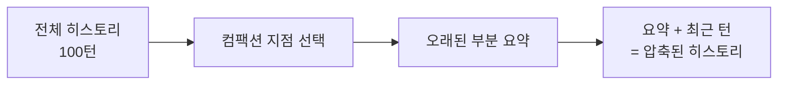

## 개요

컴팩션은 세션의 오래된 대화 내용을 **요약**하여 컨텍스트 윈도우를 효율적으로 사용하는 기법이다. 전체 대화 히스토리를 유지하면 컨텍스트 윈도우를 초과하므로, 오래된 부분을 압축한다.

**핵심 파일**: `agents/pi-embedded-runner/compact.ts`

## 동작 원리



### 컴팩션 전

```
[턴 1] 사용자: 안녕하세요
[턴 2] AI: 안녕하세요! 무엇을 도와드릴까요?
[턴 3] 사용자: 프로젝트 A 진행 상황 알려줘
[턴 4] AI: 프로젝트 A는 현재...
... (90턴의 상세 대화)
[턴 99] 사용자: 새로운 질문
[턴 100] AI: (현재 응답)
```

### 컴팩션 후

```
[요약] 이전 대화 요약: 프로젝트 A의 진행 상황을 논의했으며...
[턴 95] 사용자: 최근 질문
[턴 96] AI: 최근 답변
...
[턴 100] AI: (현재 응답)
```

## 트리거 조건

### 자동 컴팩션

세션의 토큰 사용량이 모델의 컨텍스트 윈도우에 근접하면 자동으로 트리거된다:

```
현재 세션 토큰 > 컨텍스트 윈도우 - 컴팩션 예약 토큰
→ 컴팩션 자동 실행
```

### 수동 컴팩션

`/compact` 슬래시 커맨드로 수동 실행:

```
/compact
→ 현재 세션의 히스토리 컴팩션
→ 요약 생성 후 세션 업데이트
```

## 컴팩션 알고리즘

### 컴팩션 지점 선택

어디까지를 요약하고 어디부터를 유지할지 결정한다:

```
전체 히스토리 토큰 계산
→ 컨텍스트 윈도우의 일정 비율을 "유지 영역"으로 설정
→ 유지 영역 이전의 메시지들이 요약 대상
→ 도구 호출 경계를 고려하여 자연스러운 지점 선택
```

### 요약 생성

요약 대상 메시지를 LLM에 보내 요약을 생성한다:

```
요약 대상 메시지들
→ 전용 시스템 프롬프트 + 요약 지시
→ LLM 호출 (짧은 컨텍스트)
→ 요약 텍스트 반환
```

### 세션 업데이트

요약이 생성되면 세션 트랜스크립트를 업데이트한다:

```
기존 히스토리: [턴 1, 턴 2, ..., 턴 100]
→ 컴팩션 후: [요약 엔트리, 턴 95, 턴 96, ..., 턴 100]
```

요약 엔트리는 JSONL 트랜스크립트에 특별한 엔트리 타입으로 저장된다.

## 컴팩션 vs 프루닝

| 기법 | 동작 | 데이터 보존 |
|------|------|------------|
| 컴팩션 | 오래된 대화를 요약 | 의미적 보존 (요약) |
| 프루닝 | 도구 결과를 잘라냄 | 부분 보존 |

프루닝은 도구 실행 결과가 너무 길 때 결과를 잘라내는 기법으로, 컴팩션과 별개로 동작한다. `truncateOversizedToolResultsInSession()` 함수가 담당한다.

## 메모리 플러시

컴팩션 직전에 **메모리 플러시**가 수행될 수 있다. 장기 메모리에 저장할 중요한 정보를 컴팩션으로 손실되기 전에 안전하게 보존하는 메커니즘이다.
