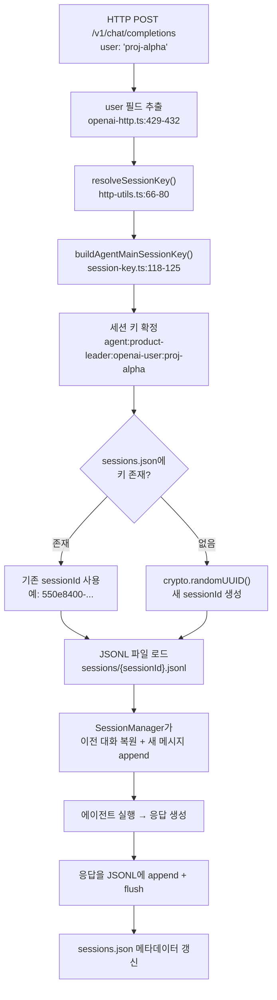

## 개요

OpenClaw의 `/v1/chat/completions` 엔드포인트는 OpenAI 호환 HTTP API다. 이 API의 `user` 필드는 단순한 추적용이 아니라 **세션 식별자**로 동작한다. 같은 `user` 값으로 반복 호출하면 이전 대화를 기억하는 stateful 세션이 형성된다.

이 문서는 HTTP 요청의 `user` 필드가 세션 키로 변환되고, 최종적으로 디스크의 JSONL 트랜스크립트 파일에 매핑되기까지의 전체 흐름을 소스 코드 레벨에서 추적한다.

## 전체 흐름 요약



## 단계별 추적

### user 필드 추출

**파일**: `gateway/openai-http.ts` (429-432행)

chatCompletions 핸들러 `handleOpenAiHttpRequest()`가 요청 본문에서 필드를 추출한다:

```typescript
const payload = coerceRequest(handled.body);
const model = typeof payload.model === "string" ? payload.model : "openclaw";
const user = typeof payload.user === "string" ? payload.user : undefined;
```

`user`는 문자열이면 그대로, 아니면 `undefined`가 된다. 이 값이 세션 분리의 핵심 키로 사용된다.

### 세션 키 생성

두 함수가 순차적으로 호출되어 최종 세션 키를 생성한다.

#### resolveSessionKey()

**파일**: `gateway/http-utils.ts` (66-80행)

```typescript
export function resolveSessionKey(params: {
  req: IncomingMessage;
  agentId: string;
  user?: string | undefined;
  prefix: string;
}): string {
  const explicit = getHeader(params.req, "x-openclaw-session-key")?.trim();
  if (explicit) {
    return explicit;
  }
  const user = params.user?.trim();
  const mainKey = user
    ? `${params.prefix}-user:${user}`
    : `${params.prefix}:${randomUUID()}`;
  return buildAgentMainSessionKey({ agentId: params.agentId, mainKey });
}
```

분기 로직:

| 조건 | mainKey 생성 | 세션 특성 |
|------|-------------|----------|
| `x-openclaw-session-key` 헤더 존재 | 헤더 값 그대로 사용 | 클라이언트가 직접 제어 |
| `user` 필드 존재 | `openai-user:{user}` | **결정적** — 같은 user = 같은 세션 |
| `user` 없음 | `openai:{randomUUID}` | **일회성** — 매 요청마다 새 세션 |

chatCompletions 엔드포인트에서 `prefix`는 `"openai"`로 하드코딩되어 있다 (`openai-http.ts` 434-441행).

#### buildAgentMainSessionKey()

**파일**: `routing/session-key.ts` (118-125행)

```typescript
export function buildAgentMainSessionKey(params: {
  agentId: string;
  mainKey?: string | undefined;
}): string {
  const agentId = normalizeAgentId(params.agentId);
  const mainKey = normalizeMainKey(params.mainKey);
  return `agent:${agentId}:${mainKey}`;
}
```

최종 형식: **`agent:{agentId}:{mainKey}`**

agentId는 `x-openclaw-agent-id` 헤더 또는 `model` 필드에서 결정된다 (`http-utils.ts` 26-64행). 미지정 시 기본값은 `"main"`.

#### 세션 키 생성 예시

| 요청 | 생성되는 세션 키 |
|------|----------------|
| `user: "proj-alpha"`, 헤더: `x-openclaw-agent-id: product-leader` | `agent:product-leader:openai-user:proj-alpha` |
| `user: "proj-alpha"`, 헤더 없음 | `agent:main:openai-user:proj-alpha` |
| `user` 없음, 헤더 없음 | `agent:main:openai:550e8400-e29b-...` (랜덤) |

**핵심**: `agentId`와 `user`의 조합이 세션을 유일하게 식별한다. 같은 `user`라도 다른 에이전트에게 보내면 별도 세션이 된다.

### 세션 키 → sessionId 매핑

**파일**: `config/sessions/store.ts` (115-154행)

세션 키가 확정되면 `sessions.json` 파일에서 기존 세션을 조회한다.

```
{stateDir}/agents/{agentId}/sessions.json
```

이 파일은 `Record<sessionKey, SessionEntry>` 구조의 JSON이다:

```json
{
  "agent:product-leader:openai-user:proj-alpha": {
    "sessionId": "550e8400-e29b-41d4-a716-446655440001",
    "updatedAt": 1715234567890,
    "chatType": "webchat"
  }
}
```

`resolveSessionStoreEntry()` 함수가 **대소문자 무시**(case-insensitive) 방식으로 키를 검색한다.

| 조회 결과 | 동작 |
|----------|------|
| 기존 엔트리 발견 | `sessionId`를 재사용 → 기존 JSONL에 이어 쓰기 |
| 미발견 | `crypto.randomUUID()`로 새 sessionId 생성 → 새 JSONL 생성 |

`sessions.json`은 인메모리 캐시(기본 TTL 45초)로 관리되어, 매 요청마다 디스크를 읽지 않는다. 파일의 `mtime` 변경이 감지되면 캐시를 무효화한다.

### sessionId → JSONL 파일 경로

**파일**: `config/sessions/paths.ts` (235-260행)

```typescript
export function resolveSessionTranscriptPath(
  sessionId: string,
  agentId?: string,
  topicId?: string | number,
): string {
  return resolveSessionTranscriptPathInDir(
    sessionId,
    resolveAgentSessionsDir(agentId),
    topicId,
  );
}
```

경로 해석 규칙:

```
{stateDir}/agents/{agentId}/sessions/{sessionId}.jsonl
```

| 예시 | 파일 경로 |
|------|----------|
| agentId=`product-leader`, sessionId=`550e8400-...` | `/opt/openclaw/agents/product-leader/sessions/550e8400-....jsonl` |
| agentId=`main`, sessionId=`abc-123` | `/opt/openclaw/agents/main/sessions/abc-123.jsonl` |

sessionId는 `/^[a-z0-9][a-z0-9._-]{0,127}$/i` 정규식으로 검증된다 (`paths.ts` 60-68행). UUID v4 형식은 항상 통과한다.

### JSONL 트랜스크립트 구조

**파일**: `config/sessions/transcript.ts` (67-86행)

JSONL 파일의 첫 줄은 세션 헤더다:

```json
{"type":"session","version":1,"id":"550e8400-...","timestamp":"2026-02-13T12:34:56Z","cwd":"/opt/openclaw"}
```

이후 줄은 대화 메시지:

```json
{"type":"message","message":{"role":"user","content":"시장 분석해줘"},"parentId":null}
{"type":"message","message":{"role":"assistant","content":"B2B 시장은..."},"parentId":"msg-uuid-1"}
{"type":"message","message":{"role":"user","content":"우선순위 뽑아줘"},"parentId":"msg-uuid-2"}
{"type":"message","message":{"role":"assistant","content":"1. 대시보드..."},"parentId":"msg-uuid-3"}
```

`parentId`로 트리 구조를 표현한다. 분기(branching)가 가능하지만, 일반적으로는 선형 대화다.

### 메시지 추가 및 세션 재개

**파일**: `agents/pi-embedded-runner/session-manager-init.ts`

기존 세션에 새 메시지가 도착하면:

```
SessionManager.openFile(sessionFile)
→ 기존 JSONL의 모든 줄을 파싱
→ fileEntries 배열 + byId Map에 적재
→ 이전 대화가 에이전트 컨텍스트에 자동 포함
→ 새 user 메시지 append
→ 에이전트 실행 (이전 대화를 참조하여 응답)
→ assistant 메시지 append
→ flush() → JSONL에 새 줄 추가
```

**이 단계가 "같은 세션이면 이전 대화를 기억한다"의 실체다.** SessionManager가 JSONL 전체를 읽어서 에이전트의 컨텍스트 윈도우에 넣는다.

## 세션 관리 메커니즘

### 만료 정책

세션 자체에는 **자동 만료(TTL)가 없다**. JSONL 파일은 디스크에 영속적으로 남는다. 정리는 유지보수 타이머가 담당한다:

| 메커니즘 | 설명 | 설정 키 |
|---------|------|---------|
| pruneAfter | 지정 기간 이후 세션 삭제 | `session.maintenance.pruneAfter` |
| maxEntries | 세션 수 상한 초과 시 오래된 것부터 삭제 | `session.maintenance.maxEntries` |
| rotateBytes | 트랜스크립트 총 용량 초과 시 로테이션 | `session.maintenance.rotateBytes` |

### 컴팩션

**파일**: `agents/compaction.ts`, `agents/pi-embedded-runner/compact.ts`

세션이 길어져서 LLM 컨텍스트 윈도우를 초과하면 컴팩션이 발생한다:

```
전체 메시지 로드
→ 토큰 수 계산
→ 컨텍스트 한도 초과 시:
  → 오래된 메시지를 청크로 분할 (splitMessagesByTokenShare)
  → 각 청크를 LLM으로 요약
  → 원본 청크를 요약 메시지로 교체
  → 압축된 트랜스크립트를 JSONL에 재기록
```

컴팩션 후 JSONL 구조:

```json
{"type":"compaction","timestamp":"2026-02-13T...","id":"compact-1","summary":"이전 대화 요약..."}
{"type":"message","message":{"role":"user","content":"최근 질문"},"parentId":"..."}
{"type":"message","message":{"role":"assistant","content":"최근 응답"},"parentId":"..."}
```

컴팩션은 세션의 핵심 맥락을 보존하면서 토큰 사용량을 줄인다. 다만 세부 디테일은 요약 과정에서 손실될 수 있다.

### 수동 리셋

사용자가 `/new` 또는 `/reset` 명령을 보내면 세션이 초기화된다. 기존 JSONL은 보존되지만 새 sessionId가 생성되어 빈 상태로 시작한다.

## delegate 스킬에서의 활용

CEO Advisor의 delegate 스킬이 이 메커니즘을 활용하는 방식:

```bash
# delegate 스킬의 페이로드 생성 (SKILL.md 75-76행)
jq -n --arg content "$AGENT_PROMPT" --arg topic "$TOPIC" \
  '{model: "openclaw", user: $topic, messages: [{role: "user", content: $content}], stream: false}'
```

`topic` 인자가 `user` 필드에 매핑된다. 이를 통해:

```
/delegate to=product-leader topic=proj-alpha prompt="시장 분석해줘"
→ user: "proj-alpha"
→ 세션 키: agent:product-leader:openai-user:proj-alpha
→ JSONL: /opt/openclaw/agents/product-leader/sessions/{uuid}.jsonl

/delegate to=product-leader topic=proj-alpha prompt="위 분석 기반 우선순위 제안해줘"
→ 같은 세션 키 → 같은 JSONL → 이전 대화 포함된 상태로 에이전트 실행
```

`topic`은 OpenClaw의 네이티브 기능이 아니라 delegate 스킬이 `user` 필드를 활용하는 **컨벤션**이다. `user` 필드 기반 세션 분리는 OpenClaw의 네이티브 기능이다.

### topic 네이밍에 따른 세션 분리

| topic | 세션 키 | 의미 |
|-------|---------|------|
| `proj-alpha` | `agent:product-leader:openai-user:proj-alpha` | Product의 proj-alpha 세션 |
| `proj-alpha` | `agent:engineering-lead:openai-user:proj-alpha` | Engineering의 proj-alpha 세션 (별도) |
| `proj-beta` | `agent:product-leader:openai-user:proj-beta` | Product의 proj-beta 세션 (별도) |

같은 topic이라도 **에이전트가 다르면 세션은 분리**된다. 프로젝트별 × 에이전트별 독립 기억 공간이 자연스럽게 형성된다.

## 설계 시사점

### 세션 영속성의 의미

`user` 필드 하나로 stateless HTTP API 위에 stateful 세션을 구현한다. 세션이 디스크에 영속되므로:

- 게이트웨이 재시작 후에도 세션이 유지된다
- 컴팩션이 장기 세션의 메모리 증가를 방지한다
- 같은 `user` 값을 사용하는 한 어떤 클라이언트에서 호출해도 같은 세션에 접근한다

### 주의 사항

- **`user` 없이 호출하면 매번 새 세션**이 생성된다 (랜덤 UUID). 세션 연속성이 필요하면 반드시 `user`를 지정해야 한다
- **세션 키는 대소문자를 무시**한다. `proj-Alpha`와 `proj-alpha`는 같은 세션이다
- **`x-openclaw-session-key` 헤더가 최우선**이다. 이 헤더가 있으면 `user` 필드는 무시된다
- **컴팩션은 비가역적**이다. 요약으로 교체된 원본 메시지는 복원할 수 없다
